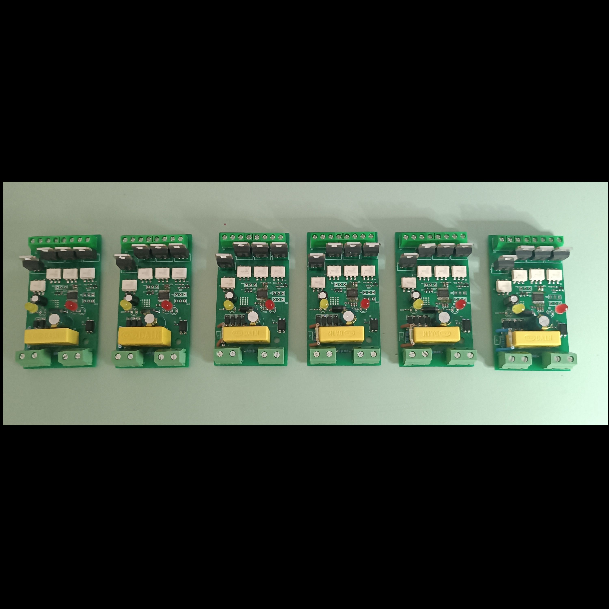

# WindSwitch



Autonomous wind protection controller for roller shutters. Monitors wind speed via anemometer input and automatically closes shutters when wind exceeds a configurable threshold.

## Overview

WindSwitch is a standalone embedded controller built around the STM32F030 microcontroller. It connects to a cup anemometer, continuously measures wind speed, and triggers a relay output to close roller shutters when wind exceeds a user-defined threshold. The system operates autonomously with no external dependencies.

## Functionality

### Wind Speed Measurement

- Frequency input from cup anemometer via TIM3 input capture on channel 4
- Measures period between rising edges and calculates frequency in real time
- Automatically resets frequency to zero if no anemometer pulses are detected for 2 seconds

### Threshold Control

- **Setpoint potentiometer** (ADC Channel 0): Configures the wind speed threshold at which the system triggers. ADC value is averaged over 10 samples and mapped to a 0-100 range.
- **Delay potentiometer** (ADC Channel 1): Configures the hold-off time before the relay deactivates after wind drops below threshold. Mapped to 0-100 minutes.
- Both potentiometers are read every 100 ms with 10-sample moving average filtering.

### Output Logic

The relay output follows a three-state machine:

1. **Idle**: Monitors wind speed. When measured frequency exceeds the setpoint, transitions to trigger wait.
2. **Trigger Wait**: Wind must remain above threshold for 2000 ms continuously. If wind drops below threshold during this period, returns to idle. Once 2000 ms elapses, activates the relay output.
3. **Active**: Relay is energized (shutter closing). When wind drops below setpoint, starts the delay timer. After the configured delay expires, deactivates the relay and returns to idle.

### LED Indicators

- **Status LED**: Blinks at 5-second intervals during normal operation. Briefly flashes on each anemometer pulse detection.
- **Hold LED**: Off during idle. Blinks during trigger wait state. Solid on when relay output is active.

### Safety

- Independent watchdog timer (IWDG) resets the system if the main loop stalls
- Error handler triggers a system reset on HAL faults

## Hardware

- **MCU**: STM32F030 (8 MHz HSI internal oscillator, no PLL)
- **Anemometer input**: TIM3 Channel 4, input capture on rising edge
- **Analog inputs**: 2x potentiometers on ADC Channel 0 and Channel 1, 12-bit resolution
- **Outputs**: Relay control (OUTCTRL), Status LED, Hold LED
- **Watchdog**: IWDG with 4095 count reload, prescaler 4

## Firmware

- Generated with STM32CubeMX, built with Keil MDK-ARM
- STM32 HAL framework
- ADC readout period: 100 ms
- Trigger debounce: 2000 ms
- Signal loss timeout: 2000 ms
- Watchdog: conditional via `USE_WATCHDOG` define

## Project Structure

```
fw/          Firmware (STM32CubeMX + Keil MDK-ARM project)
hw/          Hardware design (Altium Designer)
assets/      Images and documentation resources
doc/         Technical documentation
```
